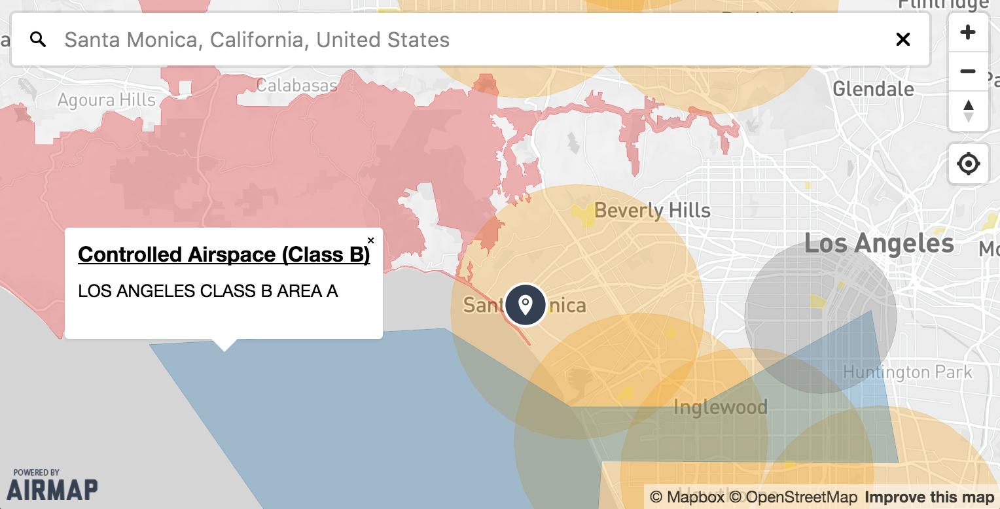

[](https://badge.fury.io/js/airmap-map-sdk)

# AirMap SDK

## Introduction

AirMap's JavaScript Maps SDK makes it easy to build beautiful airspace maps on the web. At its core, the SDK is a wrapper for
[Mapbox GL JS](https://github.com/mapbox/mapbox-gl-js) and the [AirMap Vector Tile Server](https://developers.airmap.com/reference#vector-tiles).



## Requirements

To use the Maps SDK, you must register as a developer and obtain an API key from the [AirMap Developer Portal](https://dashboard.airmap.io/developer).
Once your application has been created, simply copy the provided config JSON to provide to the SDK.
You'll also need to register for a [Mapbox Access Token](https://www.mapbox.com/help/create-api-access-token/).

## Installation

### From AirMap's CDN

```html
<!-- Latest patch release -->
<script src="https://cdn.airmap.io/js/maps/2.0.0/airmap.map.min.js"></script>

<!-- Latest minor release -->
<script src="https://cdn.airmap.io/js/maps/v2.0/airmap.map.min.js"></script>
```

### From [bower](http://bower.io)

```sh
bower install airmap-map-sdk
```

### From [npm](https://npmjs.org)

```sh
npm install airmap-map-sdk
```

> After installing the `airmap-map-sdk` module via npm or bower, you'll need bundle it up along with its dependencies
using a tool like [webpack](https://webpack.github.io/) or [browserify](https://browserify.org). If you don't have a
build process in place for managing dependencies, it is recommended that you use the module via the CDN.
[See below](#with-webpack) for instructions on using with webpack and browserify. If you install with bower and intend
to support ES5, you will also need to run your bundle through [babel](https://babeljs.io/).

## Usage

Here's an example of a minimal setup. See [Documentation](#documentation) for more details.

```html
<html>
    <head>
        <meta name="viewport" content="width=device-width, initial-scale=1.0, maximum-scale=1.0, user-scalable=no" />
        <script src="https://cdn.airmap.io/js/maps/v2.0/airmap.map.min.js"></script>
        <style>
            body {
                margin: 0;
                padding: 0;
            }
            #airspaceMap {
                position: absolute;
                width: 100%;
                height: 100%;
            }
        </style>
    </head>
    <body>
        <div id="airspaceMap">
            <!-- map is loaded here -->
        </div>
        <script>
            var config = /* your config json generated from AirMap's Developer Portal */;
            var map = new Airmap.Map(config, {
                container: 'airspaceMap',
                center: [33.9416, -118.4085],
                layers: ['airports_recreational', 'national_parks', 'tfrs', 'wildfires']
                /* refer to the docs for a comprehensive list of options */
            });
        </script>
    </body>
</html>
```

Or if using from NPM:

```js
var AirmapSDK = require('airmap-map-sdk');

var config = /* your config json generated from AirMap's Developer Portal */;
var map = new AirmapSDK(config, {
    container: 'airspaceMap',
    center: [33.9416, -118.4085],
    layers: ['airports_recreational', 'national_parks', 'tfrs', 'wildfires']
    /* refer to the docs for a comprehensive list of options */
});
```

### With [webpack](https://webpack.github.io/)

If you are using webpack to bundle your application, you'll need to install the
[transform loader](https://github.com/webpack/transform-loader) and add the following to your webpack config:

```js
{
    test: /node_modules[\\\/]airmap-map-sdk[\\\/].*\.js$/,
    loader: 'transform/cacheable?brfs'
}
```

### With [browserify](https://browserify.org)

If you are using browserify to bundle your application, you'll need to install and use the
[brfs](https://github.com/substack/brfs) transform:

```sh
$ browserify -t brfs example/main.js > bundle.js
```

### Prebuilt

If you are installing the SDK with npm, a prebuilt package is also available in `dist/airmap.map.min.js`. This will
allow you to use the SDK without changing your webpack/browserify configuration. However, using your bundler to package
all dependencies is the preferred approach (webpack recommends against using prebuilt files).

## Documentation

> [Generated API Documentation](API.md)

> [Official AirMap Docs](https://developers.airmap.com/docs/js-getting-started)

## Development

[Clone the repo](https://github.com/airmap/sdk-maps) and run `npm install`. Then run `npm start` and navigate to
[http://localhost:8080/examples/index.html](http://localhost:8080/examples/index.html) in your browser. The server will
listen for changes and live reload as updates are made.

If this is your first time developing with the SDK, you'll need to store an AirMap API Key and Mapbox Access Token
in your localStorage for use on the `examples/index.html` demo page:

```javascript
localStorage.setItem('AIRMAP_API_KEY', '<your_key>');
localStorage.setItem('MAPBOX_ACCESS_TOKEN', '<your_token>');
```

Once this is done, you won't need to do it again unless you clear your browser's localStorage.

## License

> See [LICENSE](LICENSE.md) for details.
